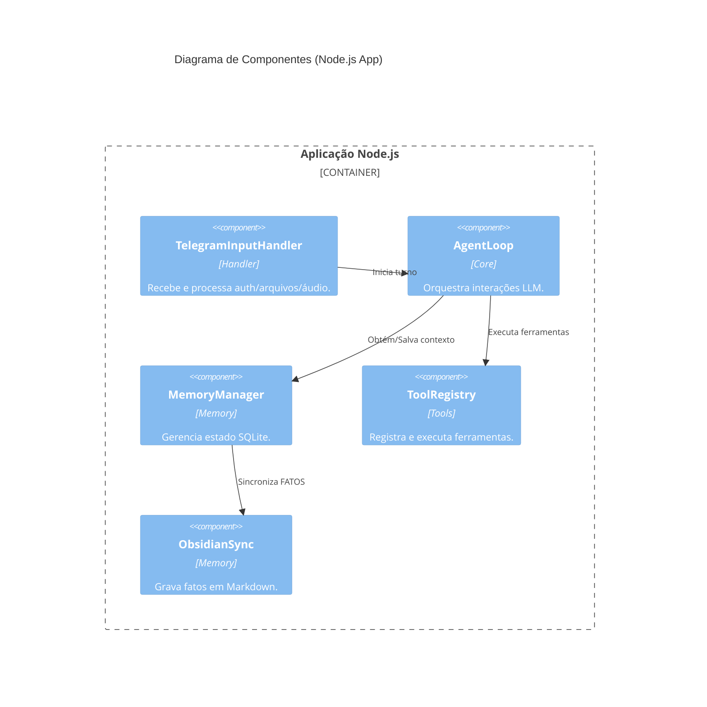

# Diagrama C4 Componentes

```mermaid
C4Component
    title Diagrama de Componentes (Node.js App)

    Container_Boundary(app_boundary, "Aplicação Node.js") {
        Component(tg_in, "TelegramInputHandler", "Handler", "Recebe e processa auth/arquivos/áudio.")
        Component(agent_loop, "AgentLoop", "Core", "Orquestra interações LLM.")
        Component(memory_mgr, "MemoryManager", "Memory", "Gerencia estado SQLite.")
        Component(tools_reg, "ToolRegistry", "Tools", "Registra e executa ferramentas.")
        Component(obsidian, "ObsidianSync", "Memory", "Grava fatos em Markdown.")
    }
    
    Rel(tg_in, agent_loop, "Inicia turno")
    Rel(agent_loop, memory_mgr, "Obtém/Salva contexto")
    Rel(memory_mgr, obsidian, "Sincroniza FATOS")
    Rel(agent_loop, tools_reg, "Executa ferramentas")
```
