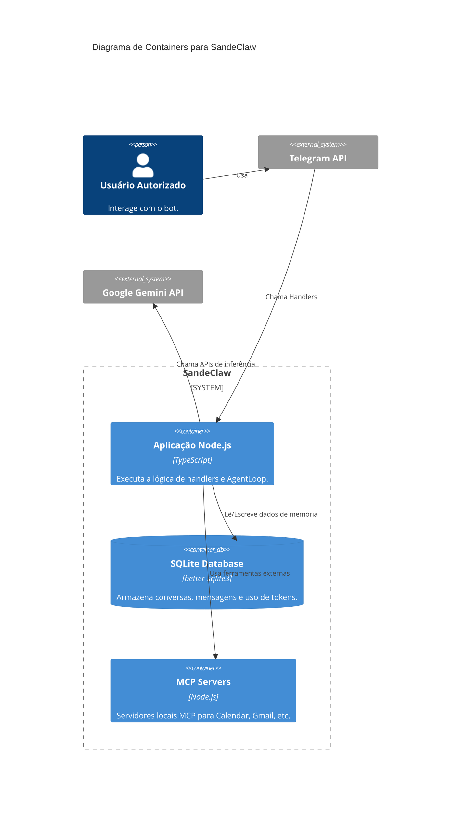

# Diagrama C4 Containers

```mermaid
C4Container
    title Diagrama de Containers para SandeClaw

    Person(user, "Usuário Autorizado", "Interage com o bot.")
    
    System_Boundary(bot_boundary, "SandeClaw") {
        Container(app, "Aplicação Node.js", "TypeScript", "Executa a lógica de handlers e AgentLoop.")
        ContainerDb(db, "SQLite Database", "better-sqlite3", "Armazena conversas, mensagens e uso de tokens.")
        Container(mcp, "MCP Servers", "Node.js", "Servidores locais MCP para Calendar, Gmail, etc.")
    }
    
    System_Ext(telegram, "Telegram API")
    System_Ext(gemini, "Google Gemini API")
    
    Rel(user, telegram, "Usa")
    Rel(telegram, app, "Chama Handlers")
    Rel(app, db, "Lê/Escreve dados de memória")
    Rel(app, mcp, "Usa ferramentas externas")
    Rel(app, gemini, "Chama APIs de inferência")
```
