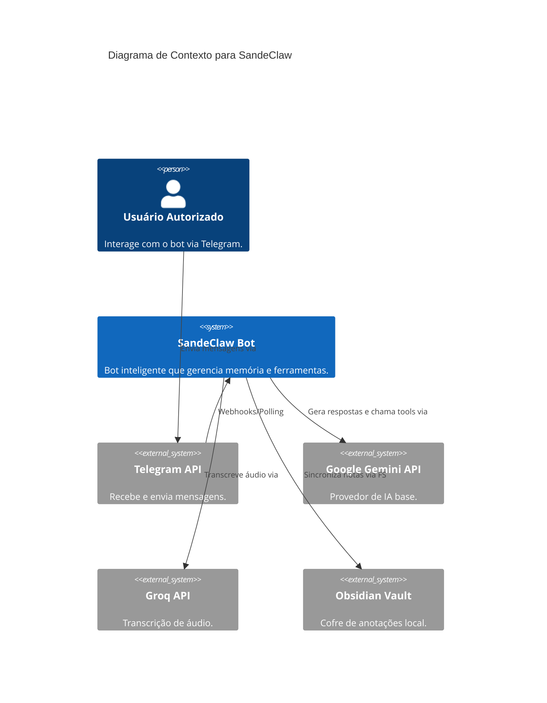

# Diagrama C4 Contexto

```mermaid
C4Context
    title Diagrama de Contexto para SandeClaw

    Person(user, "Usuário Autorizado", "Interage com o bot via Telegram.")
    
    System(bot, "SandeClaw Bot", "Bot inteligente que gerencia memória e ferramentas.")
    
    System_Ext(telegram, "Telegram API", "Recebe e envia mensagens.")
    System_Ext(gemini, "Google Gemini API", "Provedor de IA base.")
    System_Ext(groq, "Groq API", "Transcrição de áudio.")
    System_Ext(obsidian, "Obsidian Vault", "Cofre de anotações local.")
    
    Rel(user, telegram, "Envia mensagens via")
    Rel(telegram, bot, "Webhooks/Polling")
    Rel(bot, gemini, "Gera respostas e chama tools via")
    Rel(bot, groq, "Transcreve áudio via")
    Rel(bot, obsidian, "Sincroniza notas via FS")
```
