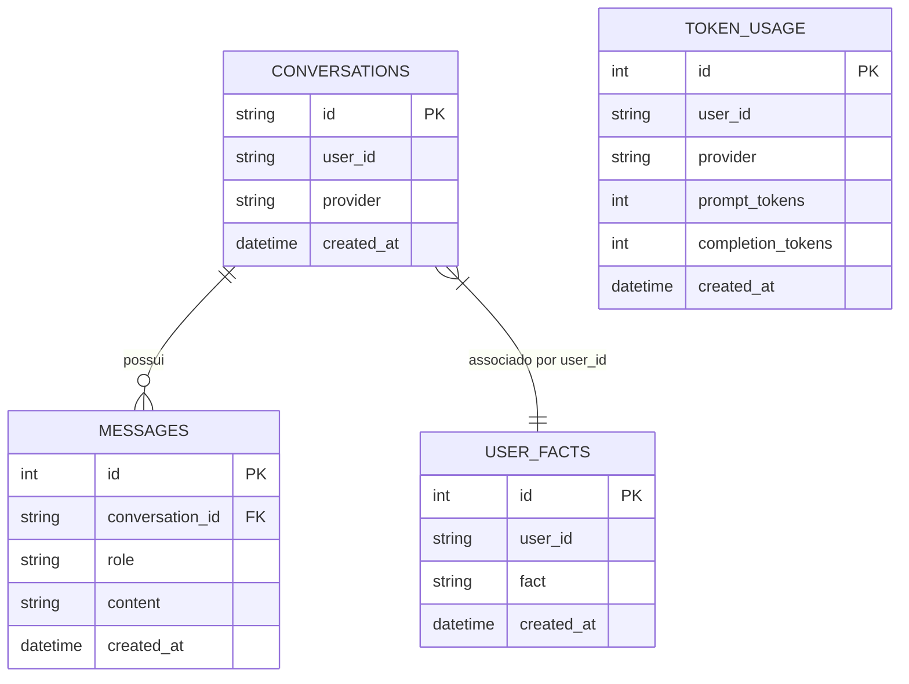

# Entity Relationship Diagram (ERD)

```mermaid
erDiagram
    CONVERSATIONS {
        string id PK
        string user_id
        string provider
        datetime created_at
    }
    MESSAGES {
        int id PK
        string conversation_id FK
        string role
        string content
        datetime created_at
    }
    USER_FACTS {
        int id PK
        string user_id
        string fact
        datetime created_at
    }
    TOKEN_USAGE {
        int id PK
        string user_id
        string provider
        int prompt_tokens
        int completion_tokens
        datetime created_at
    }
    
    CONVERSATIONS ||--o{ MESSAGES : "possui"
    CONVERSATIONS }|--|| USER_FACTS : "associado por user_id"
```
