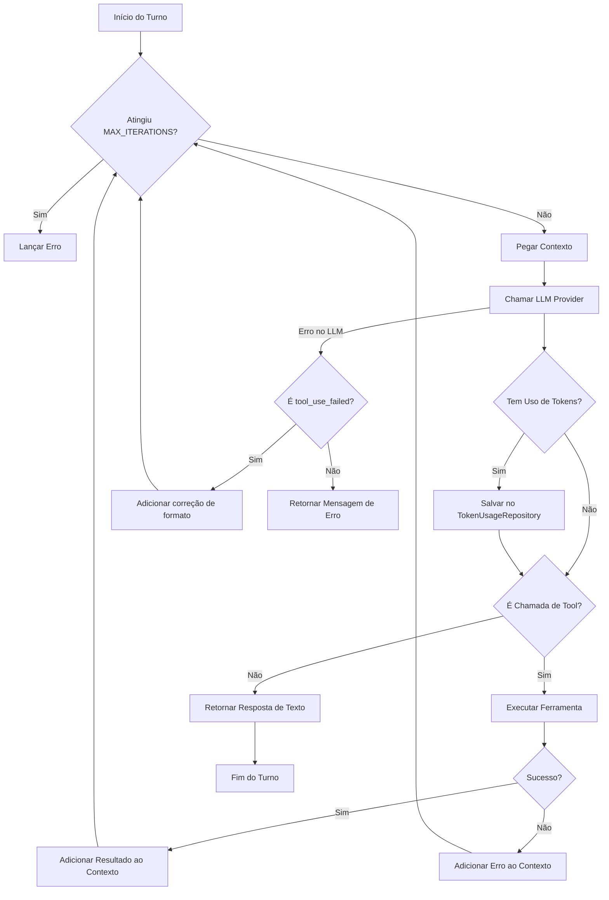

# Fluxograma — core (AgentLoop)

```mermaid
graph TD
    A[Início do Turno] --> B{Atingiu MAX_ITERATIONS?}
    B -- Sim --> C[Lançar Erro]
    B -- Não --> D[Pegar Contexto]
    D --> E[Chamar LLM Provider]
    E --> F{Tem Uso de Tokens?}
    F -- Sim --> G[Salvar no TokenUsageRepository]
    F -- Não --> H{É Chamada de Tool?}
    G --> H
    H -- Sim --> I[Executar Ferramenta]
    I --> J{Sucesso?}
    J -- Sim --> K[Adicionar Resultado ao Contexto]
    J -- Não --> L[Adicionar Erro ao Contexto]
    K --> B
    L --> B
    H -- Não --> M[Retornar Resposta de Texto]
    M --> N[Fim do Turno]
    
    E -- Erro no LLM --> O{É tool_use_failed?}
    O -- Sim --> P[Adicionar correção de formato]
    P --> B
    O -- Não --> Q[Retornar Mensagem de Erro]
```
